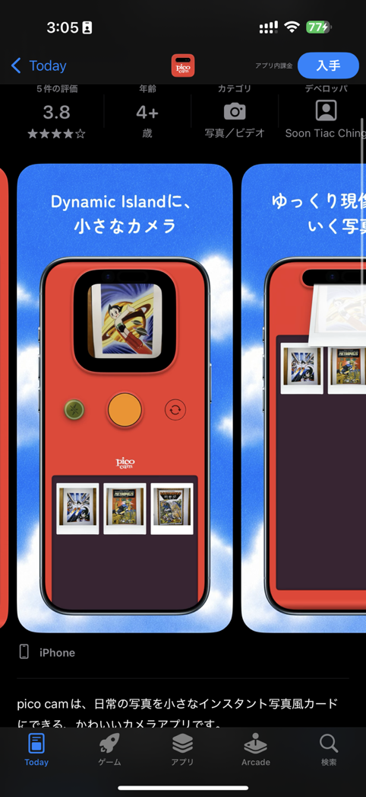
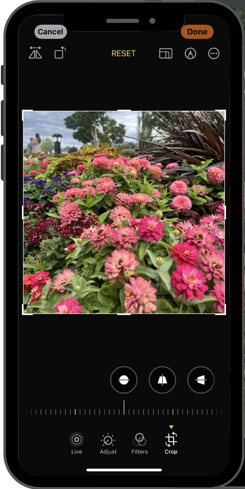
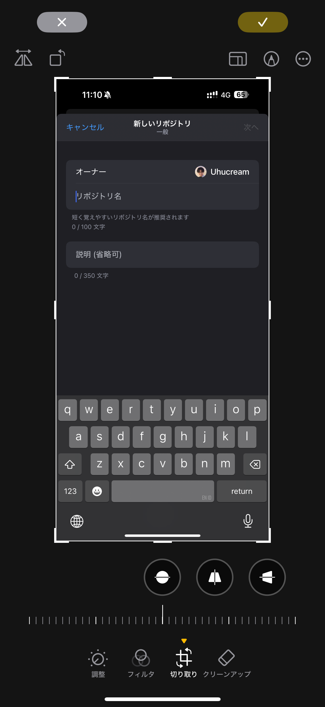
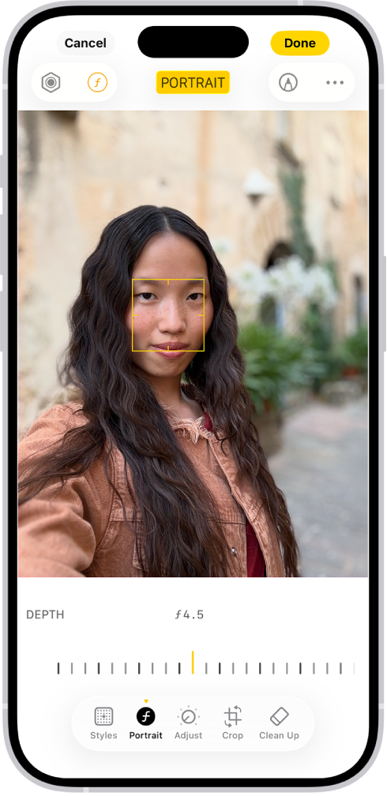

# 証明写真アプリ ロードマップ

Apple Notes に書かれていた開発ロードマップを Claude Code から参照できるように Markdown化したもの。着手前に確認すること。

大項番は対応優先順位順。PRは深さ第二の項番ごとに作成する。

> 元ノートの箇条書きの番号付けは編集の過程で崩れており(例: iOS 17/18/26/27対応のセクションで番号が1つずつしか進んでいない、あるいは重複している)、そのまま復元すると誤解を招くため、本ファイルでは元ノートの並び順は保ったまま、番号は意味のある区切りにのみ残している。

## リリース前の優先バックログ

1. iOS 26 で、証明写真作成画面でチェックマークボタンを押しても失敗する問題 (緊急で重大すぎるので他のiOS26対応よりも何より最優先) → **Done**
2. UIの修正
   - 詳細画面の日付がおかしい問題の修正 (`Date.now` が表示されてしまっているのを直す)
   - 検出された顔の領域の矩形の輪郭を、写真.appの人物切り抜き時のエフェクトのようにトレースする(写真.app のトリミング画面と似ているが故に、ズームできないのにピンチイン/アウトでズームしようとするユーザーを見かけたため)

     

   - 作成画面のチェックマークボタン押した後の成功文言を「保存しました」→「作成しました」に修正(チェックマークボタン押下時の挙動は Core Data とサンドボックスへのデータ保存だが、「保存しました」文言のせいで「写真.app に保存される」と勘違いするユーザーがいたため) → **Done**
3. パフォーマンス改善
   - TopView でスクロールヒッチが発生しているので修正する
4. 内部設計のリファクタ
   - バラけている(各ビューで同じロジックを書いている)証明写真生成ロジックをモデル化
     - 終わったらパッケージ化、プライベートリポジトリに移行、本プロジェクトから切り離し
   - 作成/編集画面の完了ボタンを押した後の、Core Data 保存・Exif改変・生成画像の Sandbox への保存、の一連の処理を UseCase 化
     - これらの変更によってメンテナンス性を向上
   - `Text()` のフォーマット方法を `FormatStyle` API を用いたやり方に変更
5. パスポートサイズ対応
6. 国際化対応
   - EU諸国除く国の言語の翻訳対応(EU対応はいろいろめんどそうなのでやらない)
   - ロケールごとに最適化したサイズ選択肢
     - TopView 左上の設定アイコンから地域設定することも可能(システムと同じ or 任意の地域)
       - 証明写真作成/編集画面にも同様に設定画面を設ける
     - ただ、これをやるにはプリセットのデータ設計を見直した方が良さそう。struct で定義ではなく JSON で assets 内に収めるなど。設計要検討
   - ロケールごとに最適なカラー選択肢
     - インドネシアのパスポートは背景色が赤じゃないとダメという情報を見た故
7. カスタムサイズ・カスタムカラー対応
   - 証明写真作成・編集画面に、カスタムカラー・カスタムサイズを追加する導線・UIを追加(多分ステータスバーに設定ボタンを置くのが一番いい)
   - カスタムサイズには名付け可能
   - 既存カラーと全く同じカラーは追加不可
   - Core Data か何らかの方法でそれらを永続化
8. ホーム画面のアイコン長押し時のアクション追加(自撮りから作成・アルバム画像から作成 の2つ)
9. iPad レイアウト対応
10. 自然にカメラ目線・理想的な証明写真素材になる独自カメラ画面
    - 多分 Dynamic Island (iPhone 14 Pro, iPhone 15-) / ノッチ(iPhone X-13 Pro) / ステータスバー(Touch ID iPhone) 付近に撮影プレビューを表示させるのがいい(pico cam のUIを参考に)

      

11. スーツ着せ機能(AIを使って。オンデバイスでプライバシー重視がウリでもあったので、一応使用には同意を必要とする)
12. コンビニ印刷対応
    - シャープの NWPSAPI のみ対応する(富士通は法人しか相手にしてない)
13. (実現可能かどうか検討した上で)写真選択画面に表示される写真を、顔が写ってる写真のみにする
    - ついでに3ヶ月以内の写真のみ選択可能にした方がいいような気がする
14. (UIのスムーズさを検討・Claude と議論した上で)写真選択画面で写真選択後、その画像でいいのか確認する画面
15. `TopViewContainer` で、`sortDescriptors` のキーを `sourcePhoto.shotDate` に変更する
16. 課金コンテンツの見直し
    - 継続的に儲かる仕組みを検討(ユーザーのお財布に優しい範囲で)
17. 詳細画面で証明写真をタップで `quickLookPreview`
18. TopView のセル長押しで詳細画面プレビュー
19. 美肌エフェクト(DNP の Ki-Rei の美肌エフェクトレベルのもの)
    - `IDPhotoEditor` に関数追加する想定

**ここまでで一旦リリース**

---

## Android 版展開

- ここまでの機能を Android 版でもつくる
  - 基本構成は Jetpack Compose + Material 3 + Jetpack Compose 公式推奨3層アーキテクチャ
  - Vision 周りの実装はできればオンデバイスが望ましいが、できないのであればクラウドで

---

## OS バージョン対応

### iOS 17 対応

- iOS 16 の `NavigationStack` を採用する
  - 他にも、iOS 16、17で入った Vision、SwiftUI の API 追加・deprecation に対応する
- Minimum Deployment Target を 17 に引き上げ
- 引き上げに伴って `TopView_iOS15` を削除
  - iOS 16 は SwiftUI の List の削除挙動にバグを抱えていた。iOS 15 での挙動が理想だったので View をあえて分けていた
- `TopView_iOS16` を `TopView` に命名変更(既存の `TopView` は 15 と 16 を分岐させるためだけのコンテナであるため削除)
- iOS 17 の新 ScrollView API を使って、背景色ピッカーを新規作成
  - 写真.app の編集画面のフィルター選択画面のように、横スクロールで色を選べるようにする
  - 写真.app の編集画面のフィルター選択画面のように、見た目をドラムピッカーのような、選択されているアイテムの両サイドのアイテムが奥まったような見た目にする

- 証明写真作成/編集画面のUI変更
  - 写真.app の編集画面UI変更に準ずる
    
    - 選択されているViewのアイコンボタン
    - インジケータの変更
       - ボタンの下に黄色い丸のデザインから、ボタンの上に黄色い逆三角形へ
       - ボタン下にラベル設置
       - × ☑︎ ボタンを、下部からステータスバー側(Dynamic Island 両側)へ移動。SF Symbol からテキストへ変更(Cancel, Done。Done の文言は要検討)
       - ボタン下ラベルが追加された代わりに画面上部のView名ラベル削除
- Vision の `VNGeneratePersonInstanceMaskRequest` で複数人検出された際に、使用対象とする人物を選択させるUI(「複数人検出されました。証明写真作成対象の人物をタップしてください」の文言(文言は要検討)とともに元画像を表示、タップしたらその人の輪郭がトレースされるエフェクトと、その人の輪郭の領域以外をすべて少しグレーアウトさせる)
- Observable 対応

### iOS 18 対応

- Minimum Deployment Target を iOS 18 に引き上げ
- 証明写真作成・編集画面のデザイン変更(iOS 18 の写真.app の編集画面のデザイン変更に準ずる)

  

  - ステータスバーのボタンを Cancel Done から × ☑︎ に変更
- Vision framework 新APIへの対応
  - struct化したやつに移行
- 他、SwiftUI や Swift、Vision 等の新APIの活用(活用できる場所があれば)

### iOS 26 対応

- Min Deploy(以下略)
- Liquid Glass 対応
  - UIの Liquid Glass化
  - アイコンを Icon Composer で作成
- 写真.app の編集画面のデザイン変更に準拠

  

  - 下ツールバーをガラスでグルーピング
  - ステータスバーのボタン(先行タスクで作ってれば)も同様に

- 証明写真作成ボタンをFAB化
   - ジャーナル.app の追加ボタンみたいな感じ

     

### iOS 27 対応

- Min Deploy(以下略)
- Icon Composer 2 でアイコン作り直し
- Apple Intelligence 対応
